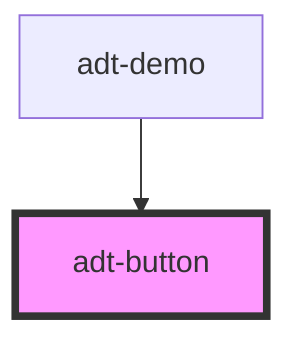

# adt-button

<!-- Auto Generated Below -->

## Properties

| Property  | Attribute | Description | Type                                                                                                                           | Default     |
| --------- | --------- | ----------- | ------------------------------------------------------------------------------------------------------------------------------ | ----------- |
| `color`   | `color`   |             | `"accent" \| "error" \| "info" \| "negative" \| "neutral" \| "positive" \| "primary" \| "secondary" \| "success" \| "warning"` | `undefined` |
| `rounded` | `rounded` |             | `boolean`                                                                                                                      | `undefined` |
| `sharp`   | `sharp`   |             | `boolean`                                                                                                                      | `undefined` |

## Dependencies

### Used by

 - [adt-demo](..)

### Graph

----------------------------------------------

*Built with [StencilJS](https://stenciljs.com/)*
