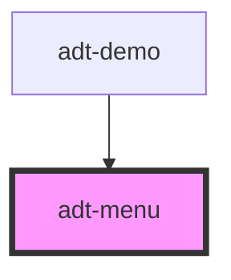

# adt-menu

<!-- Auto Generated Below -->

## Properties

| Property    | Attribute | Description | Type                                                                                                                           | Default        |
| ----------- | --------- | ----------- | ------------------------------------------------------------------------------------------------------------------------------ | -------------- |
| `color`     | `color`   |             | `"accent" \| "error" \| "info" \| "negative" \| "neutral" \| "positive" \| "primary" \| "secondary" \| "success" \| "warning"` | `undefined`    |
| `items`     | --        |             | `unknown[]`                                                                                                                    | `[]`           |
| `rounded`   | `rounded` |             | `boolean`                                                                                                                      | `undefined`    |
| `sharp`     | `sharp`   |             | `boolean`                                                                                                                      | `undefined`    |
| `stringify` | --        |             | `(item: any) => string`                                                                                                        | `item => item` |
| `template`  | --        |             | `(item: any) => any`                                                                                                           | `undefined`    |
| `value`     | --        |             | `unknown`                                                                                                                      | `undefined`    |

## Events

| Event          | Description | Type               |
| -------------- | ----------- | ------------------ |
| `itemClick`    |             | `CustomEvent<any>` |
| `valueChanged` |             | `CustomEvent<any>` |

## Dependencies

### Used by

 - [adt-demo](..)

### Graph

----------------------------------------------

*Built with [StencilJS](https://stenciljs.com/)*
