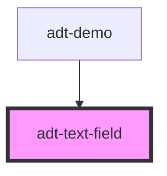

# adt-text-field

<!-- Auto Generated Below -->

## Properties

| Property      | Attribute     | Description | Type                                                                                                                           | Default     |
| ------------- | ------------- | ----------- | ------------------------------------------------------------------------------------------------------------------------------ | ----------- |
| `color`       | `color`       |             | `"accent" \| "error" \| "info" \| "negative" \| "neutral" \| "positive" \| "primary" \| "secondary" \| "success" \| "warning"` | `undefined` |
| `placeholder` | `placeholder` |             | `string`                                                                                                                       | `undefined` |
| `rounded`     | `rounded`     |             | `boolean`                                                                                                                      | `undefined` |
| `sharp`       | `sharp`       |             | `boolean`                                                                                                                      | `undefined` |
| `value`       | `value`       |             | `string`                                                                                                                       | `undefined` |

## Events

| Event          | Description | Type                  |
| -------------- | ----------- | --------------------- |
| `valueChanged` |             | `CustomEvent<string>` |

## Dependencies

### Used by

 - [adt-demo](..)

### Graph

----------------------------------------------

*Built with [StencilJS](https://stenciljs.com/)*
